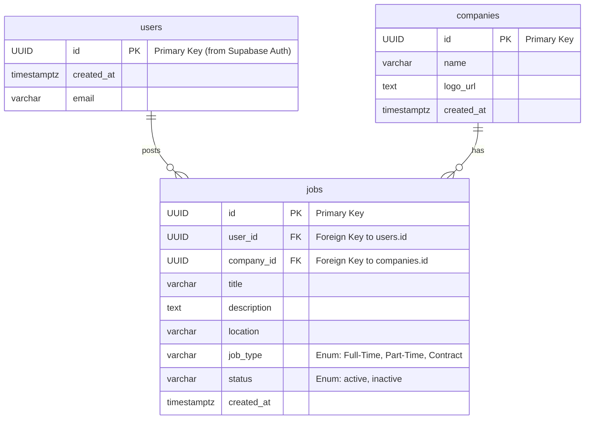

# Job Board Application

A modern job board application built with Next.js, DaisyUI, and Supabase for authentication and data management.

## Features

- 🔍 **Advanced Job Search** - Search by job title, company, and description
- 📍 **Location Filtering** - Free text location search for flexible filtering
- 🏷️ **Job Type Filtering** - Filter by Full-Time, Part-Time, and Contract positions
- 🎨 **Modern UI** - Built with DaisyUI components for beautiful, responsive design
- 🔐 **Authentication** - Secure user authentication with Supabase Auth
- 📱 **Responsive Design** - Works seamlessly on desktop and mobile devices
- ⚡ **Real-time Filtering** - Instant search results with debounced input

## Tech Stack

- **Frontend**: Next.js 15.4.2, React 19.1.0, TypeScript 5
- **UI Components**: DaisyUI 5 (Tailwind CSS v4)
- **Authentication**: Supabase Auth
- **Database**: Supabase (PostgreSQL)
- **Deployment**: Vercel

## Setup Instructions

### 1. Install Next.js

```bash
npx create-next-app@latest job-board
cd job-board
```

### 2. Install and Configure DaisyUI

Install DaisyUI and Tailwind CSS v4:

```bash
npm install daisyui@latest
npm install -D tailwindcss@4 @tailwindcss/postcss
```

Create `postcss.config.mjs`:

```javascript
const config = {
  plugins: ["@tailwindcss/postcss"],
};

export default config;
```

**Note:** Tailwind CSS v4 uses inline configuration - no separate config file needed. Configure themes and plugins through CSS imports in your `globals.css`.

### 3. Install and Configure Supabase

Set up server-side authentication with Supabase:

```bash
npm install @supabase/supabase-js @supabase/ssr
```

Create environment variables in `.env.local`:

```env
NEXT_PUBLIC_SUPABASE_URL=your_supabase_url
NEXT_PUBLIC_SUPABASE_ANON_KEY=your_supabase_anon_key
```

### 4. Database Setup

Set up your Supabase database with the following schema. Execute these SQL commands in your Supabase SQL Editor:

#### Step 1: Create Custom Types and Tables

```sql
-- Custom types for jobs
CREATE TYPE job_type AS ENUM ('Full-Time', 'Part-Time', 'Contract');
CREATE TYPE job_status AS ENUM ('active', 'inactive');

-- Users table (extends Supabase auth.users)
CREATE TABLE IF NOT EXISTS public.users (
    id UUID PRIMARY KEY REFERENCES auth.users(id) ON DELETE CASCADE,
    created_at TIMESTAMPTZ DEFAULT NOW() NOT NULL,
    email VARCHAR NOT NULL UNIQUE
);

-- Companies table
CREATE TABLE companies (
    id UUID DEFAULT gen_random_uuid() PRIMARY KEY,
    name VARCHAR NOT NULL,
    logo_url TEXT,
    created_at TIMESTAMPTZ DEFAULT NOW() NOT NULL
);

-- Jobs table
CREATE TABLE jobs (
    id UUID DEFAULT gen_random_uuid() PRIMARY KEY,
    user_id UUID NOT NULL REFERENCES users(id) ON DELETE CASCADE,
    company_id UUID NOT NULL REFERENCES companies(id) ON DELETE CASCADE,
    title VARCHAR NOT NULL,
    description TEXT NOT NULL,
    location VARCHAR NOT NULL,
    type job_type NOT NULL,
    status job_status NOT NULL DEFAULT 'active',
    created_at TIMESTAMPTZ DEFAULT NOW() NOT NULL
);
```

#### Step 2: Create Database Functions and Triggers

```sql
-- Function to automatically create user profile when signing up
CREATE FUNCTION public.handle_new_user()
RETURNS TRIGGER 
LANGUAGE plpgsql
SECURITY DEFINER SET search_path = ''
AS $$
BEGIN
  INSERT INTO public.users (id, email)
  VALUES (new.id, new.email);
  RETURN NEW;
END;
$$;

-- Trigger for automatic user profile creation
CREATE TRIGGER on_auth_user_created
  AFTER INSERT ON auth.users
  FOR EACH ROW EXECUTE PROCEDURE public.handle_new_user();

-- Function to check if user exists by email (for signup validation)
CREATE OR REPLACE FUNCTION get_user_id_by_email(email TEXT)
RETURNS TABLE (id uuid)
SECURITY definer
AS $$
BEGIN
  RETURN QUERY SELECT au.id FROM auth.users au WHERE au.email = $1;
END;
$$ LANGUAGE plpgsql;
```

#### Step 3: Create Performance Indexes

```sql
-- Users table indexes
CREATE INDEX IF NOT EXISTS idx_users_email ON public.users(email);
CREATE INDEX IF NOT EXISTS idx_users_created_at ON public.users(created_at);

-- Jobs table indexes
CREATE INDEX idx_jobs_user_id ON jobs(user_id);
CREATE INDEX idx_jobs_company_id ON jobs(company_id);
CREATE INDEX idx_jobs_created_at ON jobs(created_at DESC);
CREATE INDEX idx_jobs_job_type ON jobs(type);
CREATE INDEX idx_jobs_status ON jobs(status);
```

#### Step 4: Enable Row Level Security and Create Policies

```sql
-- Enable RLS on all tables
ALTER TABLE public.users ENABLE ROW LEVEL SECURITY;
ALTER TABLE companies ENABLE ROW LEVEL SECURITY;
ALTER TABLE jobs ENABLE ROW LEVEL SECURITY;

-- Users table policies
CREATE POLICY "Users can view own profile" ON public.users
  FOR SELECT USING (auth.uid() = id);

CREATE POLICY "Users can update own profile" ON public.users
  FOR UPDATE USING (auth.uid() = id);

-- Companies table policies
CREATE POLICY "Companies are viewable by everyone" ON companies
    FOR SELECT USING (true);

CREATE POLICY "Authenticated users can insert companies" ON companies
    FOR INSERT WITH CHECK (auth.role() = 'authenticated');

CREATE POLICY "Users can update companies they created" ON companies
    FOR UPDATE USING (auth.uid() IS NOT NULL);

-- Jobs table policies
CREATE POLICY "Jobs are viewable by everyone" ON jobs
    FOR SELECT USING (true);

CREATE POLICY "Authenticated users can insert jobs" ON jobs
    FOR INSERT WITH CHECK (auth.role() = 'authenticated');

CREATE POLICY "Users can update their own jobs" ON jobs
    FOR UPDATE USING (auth.uid() = user_id);

CREATE POLICY "Users can delete their own jobs" ON jobs
    FOR DELETE USING (auth.uid() = user_id);
```

### 5. Create Storage Bucket

Create a storage bucket for company logo:

1. Go to Storage in your Supabase dashboard
2. Create a new bucket named `company-logo`
3. Set it to public if you want logos to be publicly accessible

### 6. Install Dependencies

```bash
npm install
```

### 7. Run the Development Server

```bash
npm run dev
```

Open [http://localhost:3000](http://localhost:3000) to view the application.

## Architecture Overview

### Database Schema (ERD)



### Application Structure

```
job-board/
├── src/
│   ├── app/                           # Next.js App Router
│   │   ├── globals.css                # Global styles with Tailwind imports
│   │   ├── layout.tsx                 # Root layout with providers
│   │   ├── page.tsx                   # Home page with hero section
│   │   ├── error.tsx                  # Global error boundary
│   │   ├── not-found.tsx              # Global 404 page
│   │   ├── auth/                      # Authentication routes
│   │   │   └── confirm/
│   │   │       └── route.ts           # Email confirmation handler
│   │   ├── login/                     # Login page
│   │   │   ├── page.tsx               # Login page with form
│   │   │   ├── LoginForm.tsx          # Client-side login form
│   │   │   └── actions.ts             # Server actions for authentication
│   │   └── (with-navbar)/             # Route group with navbar layout
│   │       ├── layout.tsx             # Navbar layout wrapper
│   │       ├── dashboard/             # Dashboard pages (user-specific)
│   │       │   ├── page.tsx           # Dashboard home with job stats
│   │       │   ├── JobsTable.tsx      # Data table for user's jobs
│   │       │   ├── DeleteJobButton.tsx # Delete job action component
│   │       │   ├── actions.ts         # Dashboard server actions
│   │       │   ├── loading.tsx        # Dashboard loading skeleton
│   │       │   ├── error.tsx          # Dashboard error boundary
│   │       │   ├── edit-job/[id]/     # Edit job functionality
│   │       │   │   ├── page.tsx       # Edit job form page
│   │       │   │   ├── EditJobFormClient.tsx # Client form component
│   │       │   │   ├── DeleteJobWrapper.tsx  # Delete wrapper component
│   │       │   │   ├── actions.ts     # Edit job server actions
│   │       │   │   └── loading.tsx    # Edit form loading state
│   │       │   └── post-job/          # Post new job functionality
│   │       │       ├── page.tsx       # Post job form page
│   │       │       ├── PostJobFormServer.tsx # Server form component
│   │       │       ├── PostJobFormClient.tsx # Client form component
│   │       │       ├── CompanySelector.tsx   # Company selection widget
│   │       │       ├── PostJobSkeleton.tsx   # Form loading skeleton
│   │       │       ├── actions.ts     # Post job server actions
│   │       │       └── loading.tsx    # Post form loading state
│   │       └── jobs/                  # Public job listings
│   │           ├── page.tsx           # Jobs listing page with search
│   │           ├── JobsContent.tsx    # Client-side jobs grid and filters
│   │           ├── JobsPageSkeleton.tsx # Jobs page loading skeleton
│   │           ├── error.tsx          # Jobs error boundary
│   │           └── [id]/              # Individual job details
│   │               ├── page.tsx       # Job detail page with breadcrumbs
│   │               ├── loading.tsx    # Job detail loading state
│   │               └── not-found.tsx  # Job not found page
│   ├── components/                    # Reusable UI components
│   │   ├── job/                       # Job-related components
│   │   │   ├── JobCard.tsx            # Job listing card component
│   │   │   ├── JobFilters.tsx         # Search and filter controls
│   │   │   ├── DeleteJobModal.tsx     # Delete confirmation modal
│   │   │   └── PauseJobButton.tsx     # Job status toggle component
│   │   ├── navbar/                    # Navigation components
│   │   │   ├── Navbar.tsx             # Main navigation bar
│   │   │   ├── UserDropdown.tsx       # User account dropdown
│   │   │   ├── LogoutButton.tsx       # Logout action component
│   │   │   └── DropdownNavLink.tsx    # Dropdown navigation link
│   │   └── ui/                        # Generic UI components
│   │       ├── Breadcrumb.tsx         # Navigation breadcrumbs
│   │       ├── BreadcrumbSkeleton.tsx # Breadcrumb loading state
│   │       ├── ErrorDisplay.tsx       # Error message component
│   │       ├── Loading.tsx            # Generic loading spinner
│   │       └── Footer.tsx             # Site footer component
│   ├── lib/                           # Business logic and utilities
│   │   ├── auth.ts                    # Authentication utilities
│   │   ├── jobs.server.ts             # Server-side job operations
│   │   ├── user.ts                    # User-related utilities
│   │   ├── companies.ts               # Client-side company operations
│   │   ├── companies.server.ts        # Server-side company operations
│   │   ├── upload.ts                  # Client-side file upload
│   │   ├── upload.server.ts           # Server-side file upload
│   │   └── breadcrumbs.tsx            # Breadcrumb configuration
│   ├── types/                         # TypeScript type definitions
│   │   └── database.ts                # Supabase database schema types
│   ├── utils/                         # Utility functions
│   │   ├── format.ts                  # Data formatting utilities
│   │   ├── styles.ts                  # CSS class utilities
│   │   ├── validation.ts              # Form validation utilities
│   │   └── supabase/                  # Supabase client configurations
│   │       ├── client.ts              # Client-side Supabase client
│   │       ├── server.ts              # Server-side Supabase client
│   │       └── middleware.ts          # Supabase middleware client
│   └── middleware.ts                  # Next.js middleware for auth
├── public/                            # Static assets
│   └── *.svg                          # SVG icons and graphics
├── package.json                       # Dependencies and scripts
├── next.config.ts                     # Next.js configuration
├── postcss.config.mjs                 # PostCSS configuration
└── tsconfig.json                      # TypeScript configuration
```

## Deployment

### Vercel

1. Push your code to GitHub
2. Connect your repository to Vercel
3. Add environment variables in Vercel dashboard
4. Deploy automatically on every push

## Contributing

1. Fork the repository
2. Create a feature branch (`git checkout -b feature/amazing-feature`)
3. Commit your changes (`git commit -m 'Add some amazing feature'`)
4. Push to the branch (`git push origin feature/amazing-feature`)
5. Open a Pull Request

## Future Enhancements

Given additional development time, the following improvements could enhance the user experience and functionality:

1. **Enhanced Content Editor** - Implement a rich text editor for job descriptions, allowing employers to format their postings with better styling, bullet points, and structured content presentation.

2. **Standardized Location System** - Replace free-text location input with a structured dropdown or autocomplete system to ensure consistent location data and prevent typos or variations.

3. **Job Application System** - Enable job seekers to apply directly through the platform, with features for resume uploads, application tracking, and communication between employers and candidates.

4. **Advanced Analytics Dashboard** - Provide comprehensive metrics including application counts, job view statistics, employer response rates, and performance insights to help optimize job postings.

5. **Email Subscription System** - Allow job seekers to subscribe with their email address to receive notifications about new job postings that match their preferences, including job type, location, and industry filters.

## License

This project is open source and available under the [MIT License](LICENSE).
