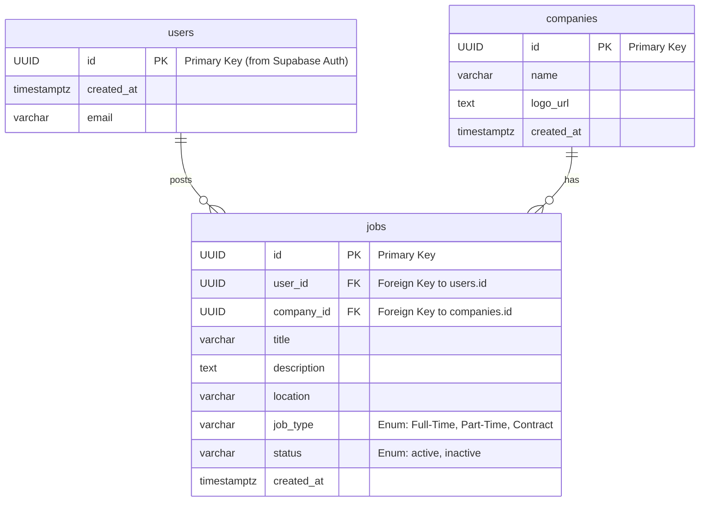

# Job Board Application

A modern job board application built with Next.js, DaisyUI, and Supabase for authentication and data management.

## Features

- 🔍 **Advanced Job Search** - Search by job title, company, and description
- 📍 **Location Filtering** - Free text location search for flexible filtering
- 🏷️ **Job Type Filtering** - Filter by Full-Time, Part-Time, and Contract positions
- 🎨 **Modern UI** - Built with DaisyUI components for beautiful, responsive design
- 🔐 **Authentication** - Secure user authentication with Supabase Auth
- 📱 **Responsive Design** - Works seamlessly on desktop and mobile devices
- ⚡ **Real-time Filtering** - Instant search results with debounced input

## Tech Stack

- **Frontend**: Next.js 14, React, TypeScript
- **UI Components**: DaisyUI (Tailwind CSS)
- **Authentication**: Supabase Auth
- **Database**: Supabase (PostgreSQL)
- **Deployment**: Vercel (recommended)

## Setup Instructions

### 1. Install Next.js

```bash
npx create-next-app@latest job-board
cd job-board
```

### 2. Install and Configure DaisyUI

Install DaisyUI for beautiful UI components:

```bash
npm install daisyui@latest
npm install -D tailwindcss postcss autoprefixer
npx tailwindcss init -p
```

Update your `tailwind.config.js`:

```javascript
module.exports = {
  content: [
    './pages/**/*.{js,ts,jsx,tsx,mdx}',
    './components/**/*.{js,ts,jsx,tsx,mdx}',
    './app/**/*.{js,ts,jsx,tsx,mdx}',
  ],
  theme: {
    extend: {},
  },
  plugins: [require("daisyui")],
  daisyui: {
    themes: ["light", "dark", "cupcake"], // Add your preferred themes
  },
}
```

### 3. Install and Configure Supabase

Set up server-side authentication with Supabase:

```bash
npm install @supabase/supabase-js @supabase/ssr
```

Create environment variables in `.env.local`:

```env
NEXT_PUBLIC_SUPABASE_URL=your_supabase_url
NEXT_PUBLIC_SUPABASE_ANON_KEY=your_supabase_anon_key
```

### 4. Database Setup

Create the following tables in your Supabase database:

#### Users Table

```sql
-- Create users table
CREATE TABLE IF NOT EXISTS public.users (
    id UUID PRIMARY KEY REFERENCES auth.users(id) ON DELETE CASCADE,
    created_at TIMESTAMPTZ DEFAULT NOW() NOT NULL,
    email VARCHAR NOT NULL UNIQUE
);

-- Enable Row Level Security
ALTER TABLE public.users ENABLE ROW LEVEL SECURITY;

-- Create policies
CREATE POLICY "Users can view own profile" ON public.users
  FOR SELECT USING (auth.uid() = id);

CREATE POLICY "Users can update own profile" ON public.users
  FOR UPDATE USING (auth.uid() = id);
  
-- Create a trigger to automatically create a user profile when a new user signs up
CREATE FUNCTION public.handle_new_user()
RETURNS TRIGGER 
LANGUAGE plpgsql
SECURITY DEFINER SET search_path = ''
AS $$
BEGIN
  INSERT INTO public.users (id, email)
  VALUES (new.id, new.email);
  RETURN NEW;
END;
$$;

-- Create the trigger
CREATE TRIGGER on_auth_user_created
  AFTER INSERT ON auth.users
  FOR EACH ROW EXECUTE PROCEDURE public.handle_new_user();

-- Indexes for performance
CREATE INDEX IF NOT EXISTS idx_users_email ON public.users(email);
CREATE INDEX IF NOT EXISTS idx_users_created_at ON public.users(created_at);
```

#### Companies Table

```sql
-- Companies table
CREATE TABLE companies (
    id UUID DEFAULT gen_random_uuid() PRIMARY KEY,
    name VARCHAR NOT NULL,
    logo_url TEXT,
    created_at TIMESTAMPTZ DEFAULT NOW() NOT NULL
);
```

#### Jobs Table

```sql
-- Job type enum
CREATE TYPE job_type AS ENUM ('Full-Time', 'Part-Time', 'Contract');
CREATE TYPE job_status AS ENUM ('active', 'inactive');

-- Jobs table
CREATE TABLE jobs (
    id UUID DEFAULT gen_random_uuid() PRIMARY KEY,
    user_id UUID NOT NULL REFERENCES users(id) ON DELETE CASCADE,
    company_id UUID NOT NULL REFERENCES companies(id) ON DELETE CASCADE,
    title VARCHAR NOT NULL,
    description TEXT NOT NULL,
    location VARCHAR NOT NULL,
    type job_type NOT NULL,
    status job_status NOT NULL DEFAULT 'active',
    created_at TIMESTAMPTZ DEFAULT NOW() NOT NULL
);

-- Indexes for better query performance
CREATE INDEX idx_jobs_user_id ON jobs(user_id);
CREATE INDEX idx_jobs_company_id ON jobs(company_id);
CREATE INDEX idx_jobs_created_at ON jobs(created_at DESC);
CREATE INDEX idx_jobs_job_type ON jobs(type);
CREATE INDEX idx_jobs_status ON jobs(status);
```

#### Row Level Security Policies

```sql
-- Row Level Security (RLS) policies
ALTER TABLE companies ENABLE ROW LEVEL SECURITY;
ALTER TABLE jobs ENABLE ROW LEVEL SECURITY;

-- Companies policies
CREATE POLICY "Companies are viewable by everyone" ON companies
    FOR SELECT USING (true);

CREATE POLICY "Authenticated users can insert companies" ON companies
    FOR INSERT WITH CHECK (auth.role() = 'authenticated');

CREATE POLICY "Users can update companies they created" ON companies
    FOR UPDATE USING (auth.uid() IS NOT NULL);

-- Jobs policies
CREATE POLICY "Jobs are viewable by everyone" ON jobs
    FOR SELECT USING (true);

CREATE POLICY "Authenticated users can insert jobs" ON jobs
    FOR INSERT WITH CHECK (auth.role() = 'authenticated');

CREATE POLICY "Users can update their own jobs" ON jobs
    FOR UPDATE USING (auth.uid() = user_id);

CREATE POLICY "Users can delete their own jobs" ON jobs
    FOR DELETE USING (auth.uid() = user_id);
```

### 5. Create Storage Bucket

Create a storage bucket for company logos:

1. Go to Storage in your Supabase dashboard
2. Create a new bucket named `company-logos`
3. Set it to public if you want logos to be publicly accessible

### 6. Install Dependencies

```bash
npm install
```

### 7. Run the Development Server

```bash
npm run dev
# or
yarn dev
# or
pnpm dev
# or
bun dev
```

Open [http://localhost:3000](http://localhost:3000) to view the application.

## Architecture Overview

### Database Schema (ERD)



### Application Structure

```
src/
├── app/                    # Next.js App Router
│   ├── (auth)/            # Authentication pages
│   ├── (with-navbar)/     # Pages with navigation
│   │   ├── jobs/          # Job browsing pages
│   │   └── dashboard/     # User dashboard
│   └── api/               # API routes
├── components/            # Reusable components
│   ├── ui/               # UI components
│   ├── job/              # Job-related components
│   └── auth/             # Authentication components
├── lib/                  # Utility functions
│   ├── supabase/         # Supabase client
│   ├── jobs.ts           # Job-related functions
│   └── auth.ts           # Authentication helpers
└── types/                # TypeScript type definitions
```

### Key Features Implementation

#### 1. Job Filtering System

The application includes a sophisticated filtering system with:

- **Search Filter**: Searches across job title, company name, and description
- **Location Filter**: Free text input allowing users to search for any location
- **Job Type Filter**: Checkbox selection for employment types
- **Real-time Updates**: Debounced search with 300ms delay for optimal performance

#### 2. Responsive Design

Built with DaisyUI components ensuring:

- Mobile-first responsive design
- Consistent styling across all devices
- Accessible form controls and navigation
- Dark/light theme support

#### 3. Authentication Flow

Secure authentication using Supabase Auth:

- Email/password authentication
- Social login options (configurable)
- Protected routes and API endpoints
- User profile management

#### 4. Performance Optimization

- Server-side rendering with Next.js
- Optimized database queries with proper indexing
- Image optimization for company logos
- Efficient pagination system

## Environment Variables

Create a `.env.local` file with the following variables:

```env
# Supabase Configuration
NEXT_PUBLIC_SUPABASE_URL=your_supabase_project_url
NEXT_PUBLIC_SUPABASE_ANON_KEY=your_supabase_anon_key

# Optional: Custom domain for production
NEXT_PUBLIC_SITE_URL=http://localhost:3000
```

## Deployment

### Vercel (Recommended)

1. Push your code to GitHub
2. Connect your repository to Vercel
3. Add environment variables in Vercel dashboard
4. Deploy automatically on every push

### Other Platforms

The application can be deployed on any platform that supports Next.js:

- Netlify
- Railway
- AWS Amplify
- Digital Ocean App Platform

## Contributing

1. Fork the repository
2. Create a feature branch (`git checkout -b feature/amazing-feature`)
3. Commit your changes (`git commit -m 'Add some amazing feature'`)
4. Push to the branch (`git push origin feature/amazing-feature`)
5. Open a Pull Request

## License

This project is open source and available under the [MIT License](LICENSE).
